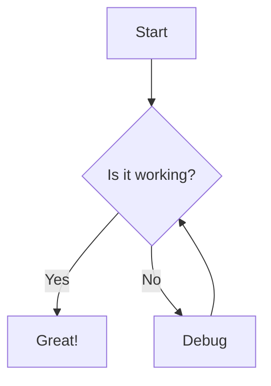

| Tables   |      Are      | Cool  |
|----------|:-------------:|-------|
| col 1 is | left-aligned  | $1600 |
| col 2 is |   centered    | $12   |
| col 3 is | right-aligned | $1    |




* joe
  * joe
    * joewals
* walker
* bigjoe

```js
export const sortBooksByDate = (
  books: BookCollection[],
  order: 'asc' | 'desc' = 'desc'
): BookCollection[] => {
  return [...books].sort((a, b) => {
    const dateA = a.pubDate instanceof Date ? a.pubDate : new Date(a.pubDate) // [!code --]
    const dateA = a.pubDate instanceof Date ? a.pubDate : new Date(a.pubDate) // [!code --]
    const dateB = b.pubDate instanceof Date ? b.pubDate : new Date(b.pubDate) // [!code ++]
    const dateB = b.pubDate instanceof Date ? b.pubDate : new Date(b.pubDate) // [!code ++]

    return order === 'asc'
      ? dateA.getTime() - dateB.getTime()
      : dateB.getTime() - dateA.getTime()
  })
}
```